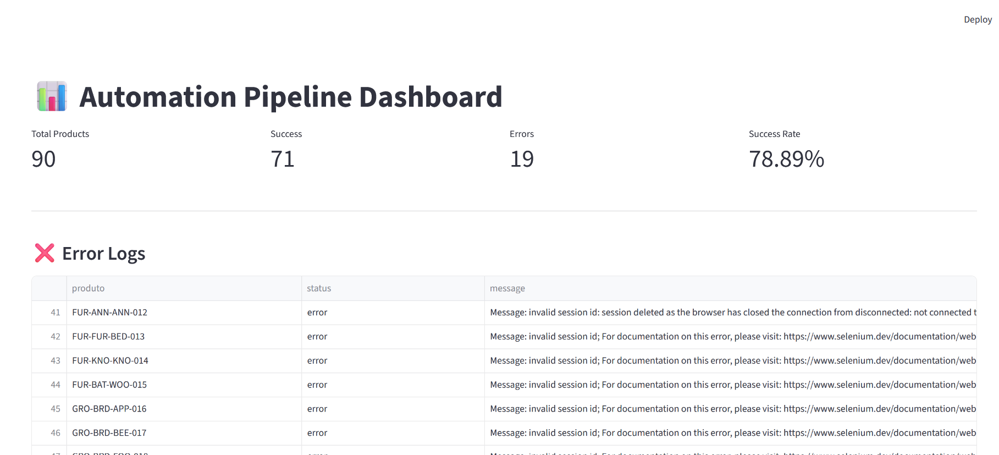
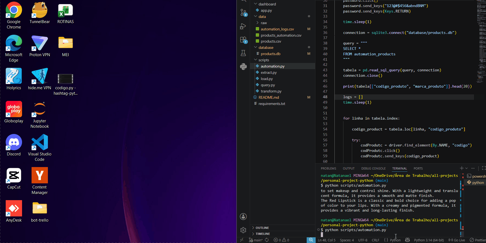

# End-to-End Automation Pipeline for Product Data Processing

## Overview

This project is an end-to-end automation pipeline built with Python that demonstrates real-world concepts of:

- API integration
- ETL (Extract, Transform, Load)
- Data cleaning
- SQLite database management
- Web automation with Selenium
- Logging and monitoring
- Interactive dashboards with Streamlit

The system extracts product data from a public API, processes and transforms the information, stores it in a SQLite database, automates product registration in a web system, and generates execution logs and analytics dashboards.

---

# Project Architecture

```text
API
 ↓
Extract
 ↓
Transform
 ↓
SQLite Database
 ↓
Selenium Automation
 ↓
Execution Logs
 ↓
Streamlit Dashboard
````

---

# Technologies Used

* Python
* Pandas
* Requests
* SQLite
* Selenium
* Streamlit
* WebDriver Manager

---

# Features

## Data Extraction

* Fetches product data from the DummyJSON API
* Handles API responses and JSON parsing

## Data Transformation

* Cleans and normalizes data
* Handles missing values (`NaN`)
* Creates automation-ready datasets

## Database Layer

* Stores transformed data in SQLite
* Centralized data source for automation and dashboards

## Web Automation (RPA)

* Automates product registration using Selenium
* Handles form filling and submission
* Includes error handling and execution resilience

## Logging System

* Tracks automation success and failures
* Stores execution logs in SQLite
* Supports observability and monitoring

## Dashboard

* Interactive dashboard built with Streamlit
* Displays:

  * Total processed products
  * Success rate
  * Errors
  * Execution metrics

---

# Folder Structure

```text
project/
│
├── data/
│   ├── products.csv
│   ├── products_automation.csv
│
├── database/
│   └── products.db
│
├── dashboard/
│   └── app.py
│
├── scripts/
│   ├── extract.py
│   ├── transform.py
│   ├── automation.py
│   ├── load.py
│   └── query.py
│
├── requirements.txt
│
└── README.md
```

---

# Setup

## 1. Clone the repository

```bash
git clone <repository-url>
cd <repository-name>
```

---

## 2. Create virtual environment

```bash
python -m venv venv
```

Activate the environment:

### Windows

```bash
venv\Scripts\activate
```

### Linux / Mac

```bash
source venv/bin/activate
```

---

## 3. Install dependencies

```bash
pip install -r requirements.txt
```

---

# Running the Project

## 1. Extract API data

```bash
python scripts/extract.py
```

---

## 2. Transform and clean data

```bash
python scripts/transform.py
```

---

## 3. Run web automation

```bash
python scripts/automation.py
```

---

## 4. Start dashboard

```bash
streamlit run dashboard/app.py
```

---
# Dashboard Preview



---

# Database Tables

## products

Raw extracted product data.

## automation_products

Cleaned and transformed data used by Selenium automation.
# Automation Demo



## automation_logs

Execution logs for monitoring automation runs.

---

# Concepts Demonstrated

This project demonstrates practical experience with:

* ETL pipelines
* API consumption
* Data cleaning and transformation
* Relational databases
* SQL queries
* RPA (Robotic Process Automation)
* Error handling
* Logging systems
* Dashboard development
* Data pipeline architecture

---

# Future Improvements

* Docker containerization
* Scheduled execution (Cron/Airflow)
* PostgreSQL migration
* Cloud deployment
* Retry mechanisms
* Authentication management with `.env`
* Advanced dashboard analytics

---

# Author

Developed by Natanael Queiroz

GitHub: ```https://github.com/natandavinci```


